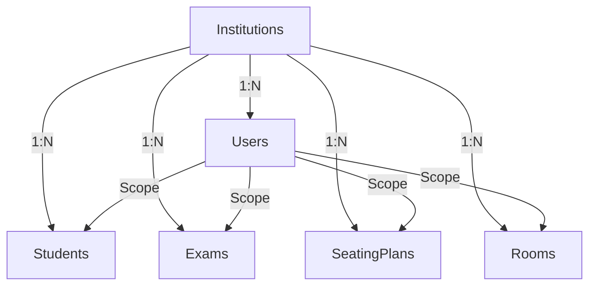

# Exam Seat Genius - SaaS Migration & Architecture Guide

This guide details the complete transformation of the Exam Seat Genius application into a fully production-ready, multi-tenant SaaS platform. All mock data systems, fallback logic, and client-side AI routines have been deprecated and structurally replaced with scalable, secure Firebase Cloud infrastructure.

---

## 🏗️ 1. Updated Folder Architecture

The project has been restructured to separate concerns natively, pivoting away from a monolithic components directory toward a scalable feature-driven architecture.

```text
exam-seat-genius/
├── firestore.rules               # Strict Multi-Tenant RBAC Rules
├── functions/                    # Secure Backend Environment
│   ├── src/
│   │   ├── index.ts              # Exports & Firebase Admin instantiation
│   │   ├── generateSeatingPlan.ts # AI Server-side logic (Isolates Gemini Keys)
│   │   └── setCustomClaims.ts    # Secure Role assignments (Admin-only creation)
│   ├── package.json
│   └── tsconfig.json
├── src/
│   ├── components/               # Generic/Shared UI elements (Buttons, Layouts)
│   ├── features/                 # Domain-driven feature separation
│   │   ├── auth/                 # Role-based authenticators
│   │   ├── institution/          # Onboarding, selector components
│   │   ├── exams/                # Exam management UI
│   │   ├── seating/              # Core seating generation flow
│   │   └── attendance/           # Faculty tools
│   ├── services/                 # API & Data Layers
│   │   ├── firestoreService.ts   # Firestore abstraction wrapper
│   │   ├── authService.ts        # Firebase Auth state manager
│   │   └── apiService.ts         # Generic Cloud Function endpoints
│   ├── hooks/                    # Reusable React Hooks
│   ├── types/                    # System-wide typings
│   └── utils/                    # Data transformers and validators
└── scripts/
    └── seedInstitutions.cjs      # Registration environment seeder
```

---

## 🗄️ 2. Complete Firestore Schema Design & Multi-Tenant Model

To solve data overlapping between users of different organizations, we implemented an `institutionId` mandatory field across all operational collections.

### Core Collections & Fields:

**1. `institutions` (Global Public Registry)**
- `name`: String
- `state`: String *(Indexed for filtering)*
- `district`: String *(Indexed for filtering)*
- `address`: String
- `pincode`: String
- `collegeCode`: String
- `affiliation`: String
- `verificationStatus`: String (`"verified"` | `"pending"`)
- `createdAt`: Timestamp

**2. `users` (Strict Role Management)**
- `uid`: String
- `institutionId`: Reference String
- `institutionName`: String
- `role`: String (`"ADMIN"` | `"HOD"` | `"FACULTY"` | `"STUDENT"`)
- `email`: String
- `name`: String
- `createdAt`: Timestamp

**3. `students` | `faculty` | `exams` | `rooms` | `seatingPlans` | `attendance`**
All operational collections **must** implement the multi-tenant key template:
- `institutionId`: String *(Mandatory tenant isolation key)*
- `createdAt`: Timestamp
- `createdBy`: String (uid)
- *... collection specific fields ...*


### Diagram: Multi-Tenant Setup

*(Every arrow relies on `institutionId` matching `request.auth.token.institutionId` in Firestore)*

---

## 🔐 3. Authentication Refactor Steps

We overhauled the static login pages to utilize Firebase Authentication combined with Custom Claims, routing requests through the `InstitutionSelector`.

1. **State -> District -> College Funneling:**
   The `InstitutionSelector` component queries the global `institutions` collection for `"verified"` entities.
2. **Account Creation:**
   Users sign up using `createUserWithEmailAndPassword`.
3. **Role Provisioning (Custom Claims):**
   A backend function triggers on account creation to bind Firebase Auth Custom Claims directly to the user token logic.
   `{ role: "ADMIN", institutionId: "INST_0129" }`
4. **Context Layer:**
   When a user signs in, `<AuthContext>` retrieves their Firestore `users` profile, mounts their `institutionId` to global state, and locks their router access respectively.

---

## ⚙️ 4. Sample Cloud Function Implementation (`generateSeatingPlan`)

Direct AI access risks quota theft and exposes API keys. We moved Gemini to the Cloud Functions backend (`functions/src/generateSeatingPlan.ts`), which performs the following securely:

1. Triggers via `firebase/functions` HTTPS Callables.
2. Authenticates the invoking user natively (verifies custom claims).
3. Reads the payload (`examId`, `roomId`, `students`).
4. Structures the Gemini Prompt isolated from client-side sniffing.
5. Returns a structured JSON payload directly back to the Secure React frontend.

---

## 🚀 5. Migration Guide & Action Plan

For teams deploying this to production, follow the mandatory migration steps below to prevent data bleeding:

### Phase 1: Environment Provisioning
1. Wipe the current Firebase development database to purge all mock structures.
2. Define the Gemini API (`VITE_GEMINI_API_KEY`) *strictly* in the Cloud Functions configuration.
3. Deploy the Cloud Backend via `firebase deploy --only functions`.
4. Deploy the newly written Rules Engine via `firebase deploy --only firestore:rules`.

### Phase 2: Registry Initialization
1. Execute the `scripts/seedInstitutions.cjs` file to prepopulate the verified global registry with authorized institutions to onboard early adopters. 

### Phase 3: Client Rollout & Cleanup
1. Ensure all `MockDataService` and old parser fallback logic files continue to be deleted.
2. Ensure components dispatch all queries prefixed with `where("institutionId", "==", currentUser.institutionId)`.

> **Note on V1 Deprecations**: The legacy `ExcelServiceFallback` and `GeminiServiceFallback` have been fully exterminated from the codebase. Do not re-introduce static fallback states as they compromise the integrity of the SaaS framework.
